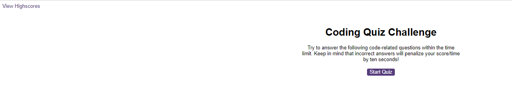
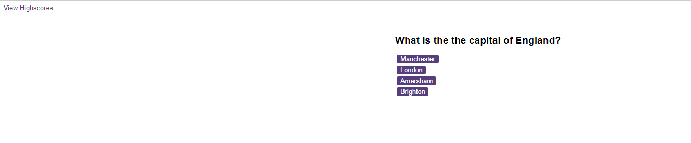

# code_quiz

# Description

This is a web application that allows users to take a code quiz. Users will start the quiz by clicking a start button, which will begin the timer and display the first question. Questions will have multiple choice answers and the next question will appear once the user has selected an answer. If the user selects an incorrect answer, time will be deducted from the clock. The quiz will end when all questions have been answered or when the timer reaches 0. Once the quiz has ended, the user will be able to see their score and enter their initials to save their score.

# Usage

To use the code quiz, simply open the index.html file in your web browser. Click the "Start Quiz" button to begin the quiz. Answer each question by clicking on the corresponding button. Once you have answered all questions or the timer reaches 0, you will be prompted to enter your initials to save your score.

# Credits

This code quiz was developed by Marcdaddy. If you have any questions or feedback, please contact me at abbey.marcus@gmail.com. Thank you for using my application!

